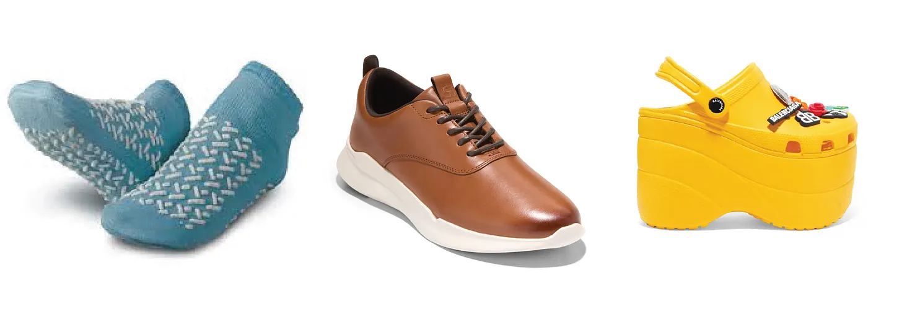
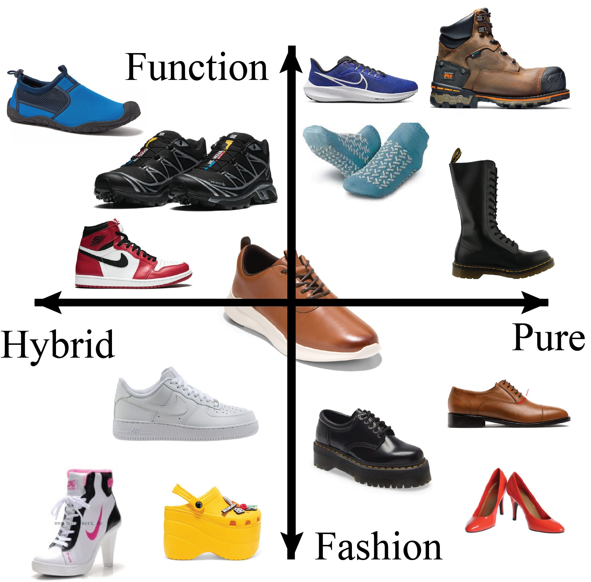

+++
date = '2026-05-16T14:42:43-07:00'
draft = false
title = 'Cole Haan Shoe Review: What is the appropriate amount to contemplate your own death?'
tags = ['opinion','materials']
+++

**Bruno Latour, Nike Air Jordan 1, Being All Things at Once**

*“We’re the highest form of life on earth and yet ineffably sad because we know what no other animal knows: that we must die.” — Don DeLillo*

Left: someone who has confronted mortality too much. Right: someone who has confronted mortality too little. Middle: Something far worse than either.

Entering my 30s meant confronting mortality while doing very little to preserve my long-term condition. My habits—from youth into adulthood and now into decline—have persisted. As I’ve aged, I’ve invested more in non-physical displays of the self—fashion, haircuts, odd behavior, recurring bits, etc. This is my performance of self in every moment.

Contemplating the self and mortality produces a kind of melancholy. The young recoil at the very thought of growing up. Modern medicine has pathologized the over-contemplation of mortality. At the same time, pushing off reality entirely also rubs people the wrong way. There can be reckless ways to live. A person can also live with hubris and deny their own mortality. This, too, can be diagnosed medically.

And yet I can think of another adult who is not contemplating their death, and it seems maybe they are not contemplating much at all, despite displaying all signs of being a highly functional person (especially by the standards of mainstream Western society). This is a person who constantly fills their mind with “productive” thoughts, which to them feels satisfying if not ecstatic. They do not want a thought to enter or exit their head with a hint of negativity. Ideally, no “bad” thought enters at all—not now, not ever.

Figure 1. Modernity.

Bruno Latour gives us machinery to discuss this type of optimal, modern person.

In We Have Never Been Modern, Latour argues that modern thought is governed by two opposing but inseparable forces: purification and hybridization. On the one hand, we try to isolate things, reduce them, define their essence. On the other, we constantly combine elements together, producing new objects out of mixtures. We are always doing both. This is what it means to be modern.

There is no mystery or hidden meaning in Latour’s words: he means that all the time we are either trying to make things as simple and reduced as possible, to really drill down into the meaning of what something is, or we are grabbing lots of things around us and mashing them together to make a new thing.

To make this concrete, consider a familiar internet argument: what counts as a sandwich? Is a hot dog a sandwich? A burrito? A pop-tart? These debates are trivial, but they reveal the underlying mechanism. We are constantly testing the boundaries of categories—purifying them, then breaking them apart again through hybridization.

The process of hybridization and purification has played out quite apparently in the recent history of shoe fashion. Figure 1 displays a current alignment chart with Latour’s hybrids and pures on the horizontal axis and the contrasts of aesthetic versus functional on the vertical axis.

Let’s walk through Latour’s purification-hybridization process by examining the rise of the basketball sneaker. As the game of basketball modernized and changed in the 1980s and 1990s, sports equipment evolved along with it. Modern players require shoes that can handle the intensity of modern play styles.

Originally, the development of basketball shoes focused purely on functionality; proper cushioning for the feet, durability when sprinting or cutting, support for the ankle while turning. Thus we can say it started originally as a purely functional shoe. With the growing popularity of the NBA, though, capital begins to fetishize the aesthetic of the basketball shoe. Now, shoe companies are no longer concerned solely with the functionality of the shoes, now they want it to look good too. Thus we begin the processing of hybridizing the functional basketball shoe with modern consumer aesthetics. The Air Jordan 1 is probably the best example of this; designed both to look good but also be functional for basketball.

Figure 2. The evolution of function and aesthetics in the history of basketball shoes.1

But now, basketball shoe culture has evolved for 30 years; the shoes themselves have evolved considerably with both the game of basketball and consumer tastes. Most importantly, the consumer base of the basketball shoe has grown tremendously to the point that a considerable portion of the population is concerned solely with wearing basketball shoes. Thus, what was previously a hybrid of a functional shoe and an aesthetic shoe has now become its own pure category of shoe. The process that plays out in Figure 3 shows our attempt to purify the hybrid. The basketball shoe is no longer subsumed under the category of ‘sports shoes’ or ‘fashion shoes’ but is now a category in its own right.

Thus, we moderns continually take pure concepts and bring them together into hybrids, until we come up with something entirely new that becomes pure.

The Cole Haan Remastered shoe appears to follow this same trajectory—but it fails.

On the one hand, you have traditional white collar shoes like Oxfords, Derbies, and Loafers, shown in the bottom right hand side of Figure 1. On the other hand, you have modern running shoes like the Adidas Cloudfoam series or the Nike Zooms. Cole Haan, smelling the desperation of modern white collar workers, stepped in with a solution for the over-worked finance bro who needs to hit the gym at 6am and hit the boardroom at 7am; the Cole Haan ‘Remastered’ series.

The Cole Haan Remastered, centered in the middle of Figure 1, fails in both the boardroom and in the gym - and simultaneously it fails to be fashionable in any one scenario. Perhaps worse, it fails to be a hybrid; in the boardroom it is instantly perceived as something off, especially relative to Oxfords and Derbies. The ungodly sight of faux leather in a gymnasium is sure to make even the most stoic bro jump in concern. It attempts to combine two purified domains, but is rejected by both. It never stabilizes into a new hybrid category; it remains an unstable object.

This failure is not merely aesthetic. It points to something deeper. Why does this object exist at all? The answer returns us to mortality.

When contemplating your own death, there are many obvious conclusions to make. Firstly, there is the absolute rejection of the thought, to push it out of your head entirely and try to focus solely on the moment. Bohemians and free spirits embody this lifestyle. I think about the 24/7 party girl and the man who jumps out of airplanes for fun. These people are seeking to be enraptured in the moment at all moments, never wanting to consider what the future may bring.

Another option is to be confronted with your death and choose a guiding principle. Make things easier on yourself by sticking to a moral. Life is constantly throwing scenarios at you; it’s useful to have a framework that provides an answer for most scenarios. Religion and consumerism can fill this void. Perhaps you choose the life of an ascetic and wear only the cheapest, most barebones shoes possible. Perhaps you choose the life of the aesthetic and choose to decorate yourself lavishly with this one life, constantly keeping up with changing trends.

There is a more cold and calculating way of approaching one’s own mortality. I encounter this modality in myself and often in the people I’ve grown close to. People who calculate how to spend a life. You have x amount of moments to live between now and your death, whenever it may be. Now take a second and consider how you would, in this current moment, like to spend those moments. Most likely you imagine them to be ‘happy’ instead of ‘sad.’ The willfully ignorant, the rejectionists, the dogmatist, at least the true among them; they are not thinking ahead in this way. They have a mantra and they stick to it, time after time. The religious do not think they way; they encounter every life scenario and take action based on their holy book of answers.

But you are calculating.2 How many years until mental decline, or extensive physical depreciation? How much can I fit into that time? What if I do this for now and that for later? What about a backup plan, or a backup backup plan? You, who have now calculated the spread of your happiness over time, you face external realities. Forces that seek to diminish or work against your happiness. You must take this into account when calculating happiness over x. So how do you respond to those external forces? Maybe if you write in your journal or make a list of every good and bad thing that can possibly happen until you have calculated every answer before it is needed. At the same time a car might hit you any instant now, so maybe have a glass of liquor while writing that list. Enjoy this moment while calculating the next. Inevitably, you never enjoy the drink and you never finish the list.

People in our modern Western society are calculating their happiness distributed over X amount of time and coming up with increasingly insane ways of solving that problem. One of those choices is to optimize. The Cole Haan Hybrid Dress Sneaker seeks to be the aesthetic of optimization. You must be a corporate drone and you better look good. Be successful and be attractive and be healthy and be optimal. In every moment, from now until your death, you must be all things at all times.

To have lived a life where every second is occupied by a thought and every thought by an awareness of seconds, does someone live a full life? It would seem that you are counting up toward your death. Does living a life in constant escapement from the knowledge of death mean a better life? If you are constantly optimizing, you are also constantly anticipating. You are always slightly ahead of yourself, always leaning into the next moment. In this sense, you are already moving toward your death—not as an abstract endpoint, but as something you are actively approaching through calculation.

You cannot have a purely hybrid approach to your life: you are better off either delving solely into the pure (through the adoption of a specific aesthetic) or into a constant adaptation of the hybrid (through the constant adoption/integration of new aesthetics).

The Cole Haan shoe fails because it tries to resolve a contradiction that cannot be resolved—and in doing so, it reveals something uncomfortable about the way we live.

1
A historical note: modern readers may associate the top two shoes (the Converse All-Star and the Nike Air Force 1) as being ‘fashionable’ shoes. Both of these shoes were originally developed for the game of basketball, often in conjunction with professional players. They have now been subsumed under the ‘fashionable.’ This process is probably better explained by Baudrillard than by Latour.

2
Whether this mode of calculation has always existed in humans, or it is a mental derangement, or whether it is a facet of capitalism, neoliberalism, modernity etc…the author does not take a stance. He only acknowledges it as an empirical observation at best and anecdote at worst.

Subscribe to natertot
Launched 4 months ago
deeply unserious
By subscribing, you agree Substack's Terms of Use, and acknowledge its Information Collection Notice and Privacy Policy.
4 Likes
